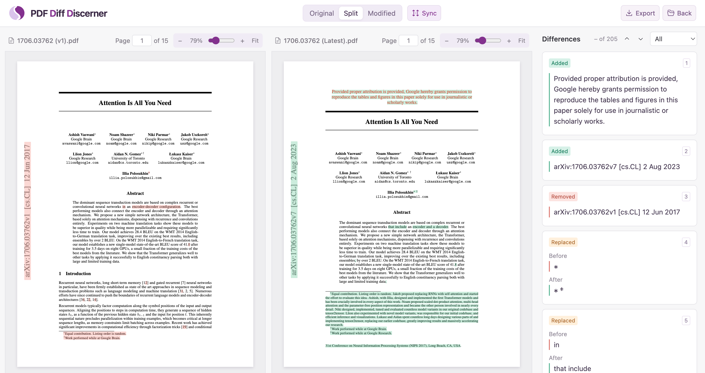

# PDF Diff Discerner

Compare PDFs in your browser with text highlights, linked scrolling, change navigation and PDF export. [中文说明](#中文说明)



## Quick start

Online: [Web app](https://ensemblism.github.io/pdf-dd/) in a modern desktop browser.

Local: requires Node.js 24+ and a modern desktop browser. Git is needed for Git history. Run:

```bash
npx pdf-dd@latest
```

Opens [localhost](http://127.0.0.1:8765/pdf-dd/). Stop with `Ctrl+C`.

## Usage

Choose your PDFs, then click **Make a difference!** to compare. Use **Differences** to jump between edits, **Sync** to link scrolling, and **Export** to save a comparison PDF.

### Online

- Local PDFs: drop or choose the original and modified files.
- arXiv: enter a link or ID (e.g., `1706.03762` or `1706.03762v6`), then click **Load PDFs** to load that version (v1 by default) and Latest.

### Local

- Local PDFs: drop or choose files, or pass their paths through the CLI.
- arXiv: enter a link or ID and click **Find versions**. You can choose any two versions.
- Git: choose a file or enter a PDF path, then compare two commits.

#### CLI

Run `npx pdf-dd@latest` to start the local server and open the file selection page. Pass two PDF paths to compare them automatically in the browser, with the original on the left and the modified file on the right:

```bash
npx pdf-dd@latest "path/to/old.pdf" "path/to/new.pdf"
```

| Option            | Function                                                                          |
| ----------------- | --------------------------------------------------------------------------------- |
| `--port PORT`     | Choose a port (default: `8765`); `--port 0` uses an available temporary port.     |
| `--no-open`       | Start the server without opening a browser; open the URL printed in the terminal. |
| `--help`, `-h`    | Show usage help.                                                                  |
| `--version`, `-v` | Show the installed package version.                                               |

Options work with or without PDF paths. For example:

```bash
npx pdf-dd@latest "path/to/old.pdf" "path/to/new.pdf" --port 9000 --no-open
```

Press `Ctrl+C` in the terminal to stop the server.

## Privacy

Comparison and export run in your browser. Local PDFs stay on your computer. arXiv PDFs download directly from arXiv; the local edition also fetches version history through Node.js.

Recent links and paths are saved in this browser and can be cleared. No accounts, no uploads.

## Run from source

From the repository directory, with Node.js 24+:

```bash
npm ci
npm run build:local
npm start
```

## License

[MIT](LICENSE). Copyright © 2026 Ensemblism.

---

# 中文说明

PDF Diff Discerner 在浏览器中对比 PDF，提供文字高亮、同步滚动、差异定位和 PDF 导出。 [English README](#pdf-diff-discerner)


## 快速开始

在线版：用现代桌面浏览器打开[网页](https://ensemblism.github.io/pdf-dd/)。

本地版：需要 Node.js 24+ 和现代桌面浏览器；Git 历史功能还需安装 Git。运行：

```bash
npx pdf-dd@latest
```

自动打开[本地页面](http://127.0.0.1:8765/pdf-dd/)，按 `Ctrl+C` 停止。

## 用法

选择 PDF 后，点击 **Make a difference!** 开始比较。通过 **Differences** 定位差异，**Sync** 同步滚动，**Export** 导出比较 PDF。

### 在线版

- 本地 PDF：拖入或选择原版与修改后的文件。
- arXiv：输入链接或 ID（例如 `1706.03762` 或 `1706.03762v6`），点击 **Load PDFs**，加载指定版本（默认 v1）和最新版。

### 本地版

- 本地 PDF：拖入或选择文件，也可通过 CLI 传入文件路径。
- arXiv：输入链接或 ID，点击 **Find versions**，可任选两个版本。
- Git：选择文件或输入 PDF 路径，比较两个提交版本。

#### CLI

运行 `npx pdf-dd@latest` 启动本地服务并打开文件选择页面。传入两个 PDF 路径，即可在浏览器中自动开始比较，第一个是左侧原版，第二个是右侧修改版：

```bash
npx pdf-dd@latest "path/to/old.pdf" "path/to/new.pdf"
```

| 参数              | 功能                                                   |
| ----------------- | ------------------------------------------------------ |
| `--port PORT`     | 指定端口，默认 `8765`；`--port 0` 使用可用的临时端口。 |
| `--no-open`       | 启动服务但不自动打开浏览器，可手动打开终端输出的网址。 |
| `--help`、`-h`    | 显示用法帮助。                                         |
| `--version`、`-v` | 显示已安装的软件包版本。                               |

无论是否传入 PDF 路径，都可以使用这些参数。例如：

```bash
npx pdf-dd@latest "path/to/old.pdf" "path/to/new.pdf" --port 9000 --no-open
```

在终端按 `Ctrl+C` 停止服务。

## 隐私

比较和导出均在浏览器中完成，本地 PDF 不会外传。arXiv PDF 直接从 arXiv 下载；本地版另由 Node.js 获取版本历史。

最近使用的链接和路径保存在当前浏览器中，可随时清除。无需账号，无需上传。

## 从源码运行

安装 Node.js 24+ 后，在项目目录执行：

```bash
npm ci
npm run build:local
npm start
```

## 许可证

[MIT](LICENSE)，版权所有 © 2026 Ensemblism。
